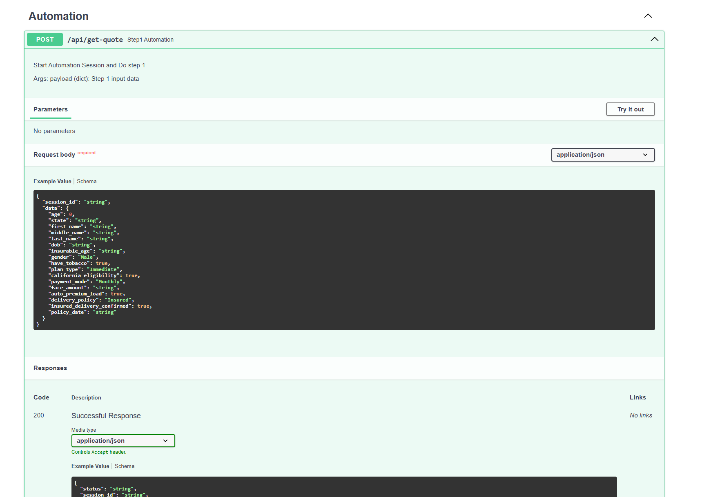

# 🚀 API-Driven Browser Automation System  
### *FastAPI • Selenium • Pydantic • Session-Based Multi-Step Automation*

## 📌 Overview
This project is a **high-performance API-driven browser automation framework** built with **FastAPI**, **Selenium**, and **Pydantic**.  
The system allows clients to trigger **multi-step, stateful browser automation workflows** purely through API calls.

Each automation step is executed through API endpoints, while a custom **session management layer** keeps track of workflow progress, temporary data, and error recovery states. The architecture is designed for **scalability, reliability, and precise data validation**.

## ✨ Key Features
### 1. API-Controlled Automation
- Built with **FastAPI** for high-performance asynchronous operations.
- Each automation step is triggered by API endpoints.
- Clean separation between API and automation engine.

### 2. Stateful Session Management
- Each user/workflow gets its own **session token**.
- Supports parallel automation processes.
- Tracks:
  - current step,
  - temporary data,
  - error status.
- Allows workflow **resume** from last successful step.

### 3. Robust Validation Using Pydantic
- Handles high variation in incoming data.
- Ensures strict validation before automation starts.
- Clear, descriptive error messages.

### 4. Multi-Step Browser Automation (Selenium)
- Real browser automation using Selenium WebDriver.
- Modular step-by-step automation: login, navigation, fills, scraping, download, etc.

### 5. Error-Resilient & Retry-Friendly
- Failed steps can be retried automatically.
- Supports restart from checkpoints.
- Prevents full workflow breakdown.

## 🏗 Architecture
Client → FastAPI Controllers → Session Manager → Automation Engine → Selenium Browser

## 🔧 Tech Stack
- **FastAPI**
- **Pydantic**
- **Selenium WebDriver**
- **Python 3.x**
- Structured Logging

## 📂 Project Structure
```bash
fastapi_selenium_automation/
|-- app/
|    |-- __init__.py
|    |-- main.py
|    |-- core/
|    |   |-- __init__.py
|    |   |-- manager.py
|    |   |-- selenium_worker.py
|    |   `-- services/
|    |       |-- __init__.py
|    |       |-- automation_components.py
|    |       |-- automation_flow_step1.py
|    |       |-- automation_flow_step2.py
|    |       |-- automation_flow_step3_beneficiary.py
|    |       |-- automation_flow_step3_coverage_info.py
|    |       |-- automation_flow_step3_owner_payor.py
|    |       |-- automation_flow_step3_payment.py
|    |       |-- automation_flow_step3_personal_info.py
|    |       |-- automation_flow_step4.py
|    |       `-- automation_flow_step5.py
|    |-- routes/
|    |   |-- __init__.py
|    |   `-- automation_routes.py
|    |-- schemas/
|    |   |-- __init__.py
|    |   |-- request.py
|    |   |-- response.py
|    |   `-- requests/
|    |       |-- __init__.py
|    |       |-- step1_schemas.py
|    |       |-- step2_schemas.py
|    |       |-- step3_schemas.py
|    |       |-- step4_schemas.py
|    |       `-- step5_schemas.py
|    `-- utils/
|        |-- __init__.py
|        |-- check_element.py
|        `-- logger.py
|-- README.md
|-- requirements.txt
|-- docker-compose.yml
|-- Dockerfile
|-- .gitignore

```

# 🖼️ Screenshots





## 🚦 Example API Flow
1. Create Session  
2. Login Step  
3. Navigation Step  
4. Form, Submit, Scrape Steps  
5. Completion

## 💪 Demonstrates
- Clean API architecture
- Browser automation
- Data validation
- Stateful workflow logic
- Error recovery and retry logic

## 🎯 Use Cases
- RPA automation
- Form submission automation
- Multi-user workflow processing

